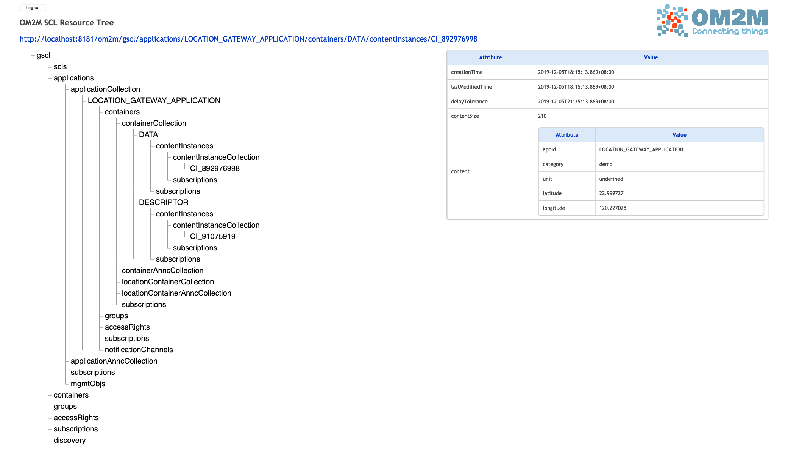
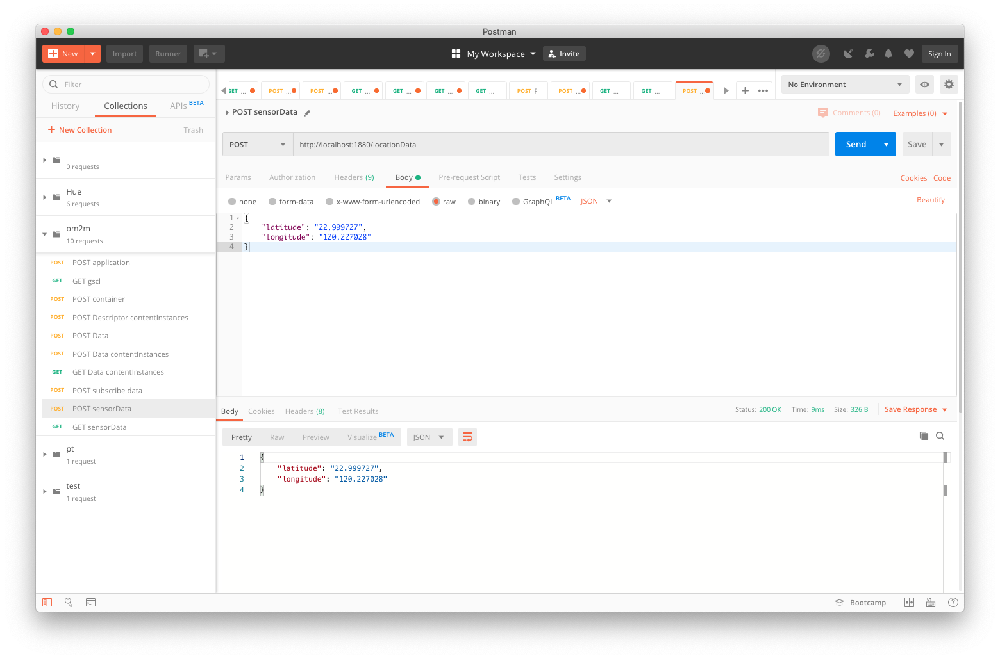
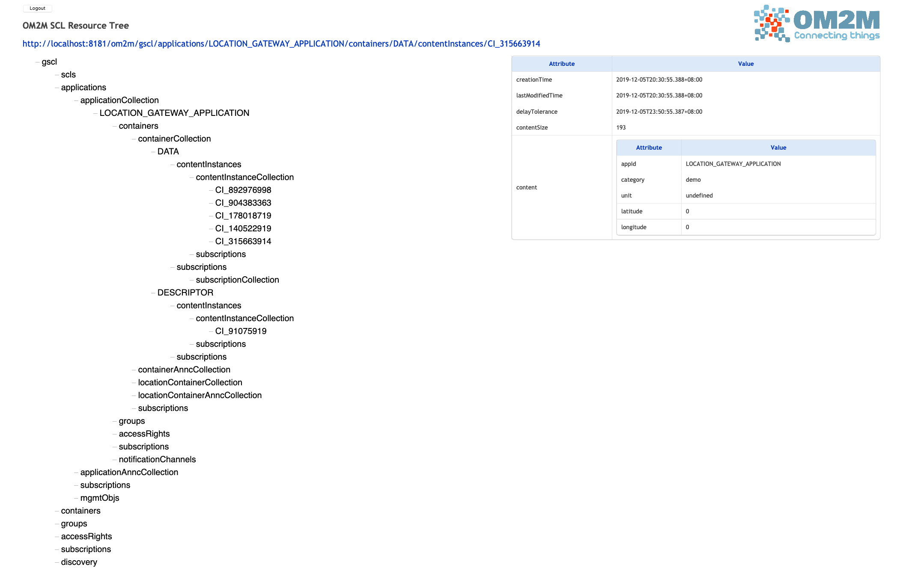
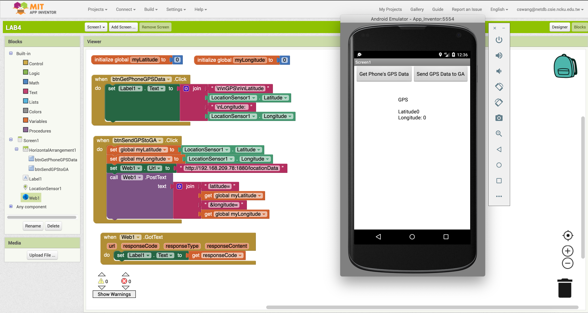
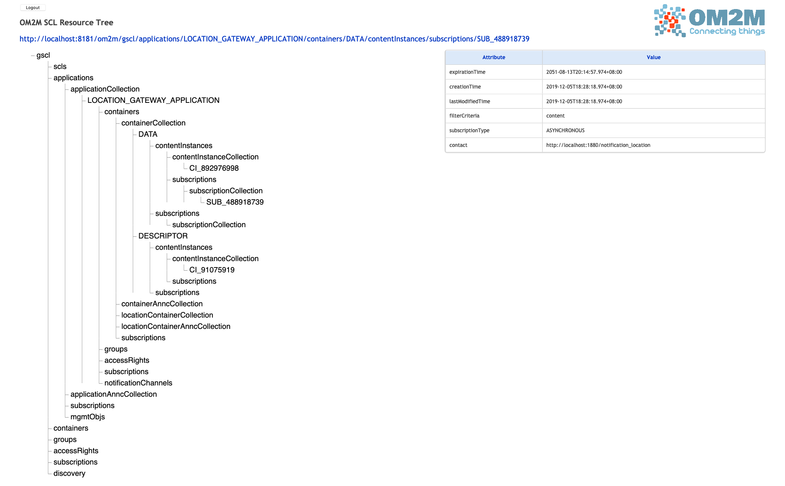
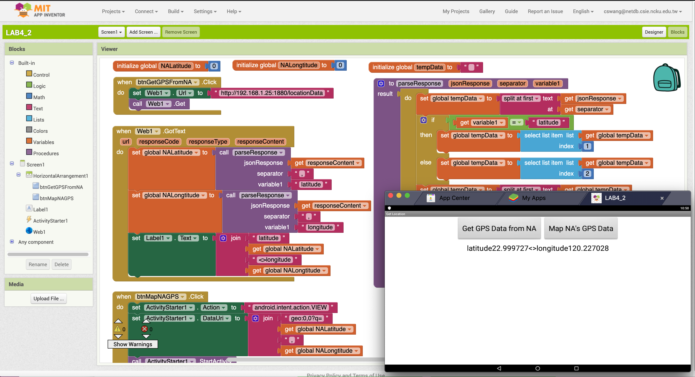
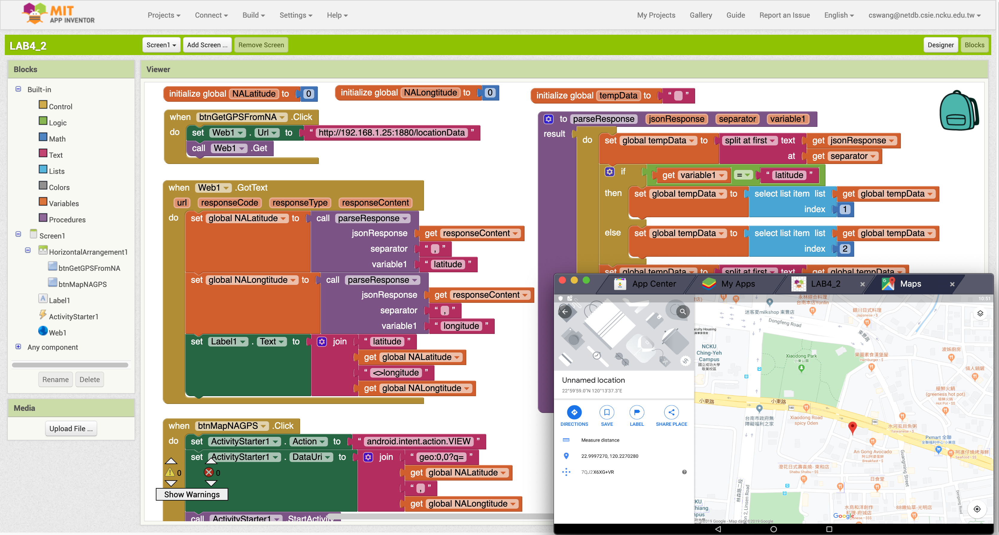

# 記得在 project 標頭標記學號與姓名 (此行請自行刪除)

# 檔案說明

    + [notification.xml](./notification.xml): Node-red 根據訂閱的 Data 將座標資訊寫入檔案
    + [InventorSender.aia](./InventorSender.aia): Get phone's location and send to server.
    + [InventorReceiver.aia](./InventorReceiver.aia): Get server's location and show on map.
    + [GA.json](./GA.json): node-red json clipboard
    + [NA.json](./NA.json): node-red json clipboard

# LAB4_GA with Node-red
## 目標:
    使用 node-red 分別建立以下
	  1. Create a "Location_Gateway_Application" Application on OM2M
		2. Create a "DESCRIPTOR" container on OM2M
		    3. Create a "DESCRIPTOR contentInsances" on OM2M
		4. Create a "DATA" container on OM2M
			5. Create a "DATA contentInsances" (for testing) on OM2M
    6. Create a http node to forward data to GSCL

## 作法or步驟:
    Note: set xSCL to gscl
    1. Create "MY_SENSOR" Application through "POST application"
    2. Create "DESCRIPTOR" through "POST container"
    3. Create "DESCRIPTOR contentInsances" through "POST Descriptor contentInstances"
    4. Create "DATA" through "POST Data"
    5. Create "DATA contentInsances" through "POST Data contentInstances"
    6. Create "Subscription" through "POST subscribe data"

## Screenshots

send data to om2m successfully

# LAB4_App Inventor Sender
## 目標:
    須完成兩個功能
        1.讀取手機(or 模擬器)的location sensor
        2.將其值交給 GA(node-red)

## 作法or步驟:
    1. Get device's location through LocationSensor
    2. Show location on Label
    3. Send a post request to red-node through Web
    4. red-node receive location

## Screenshots

# LAB4_NA with Node-red
# 目標:
    使用 node-red 建立以下
    1. Create a "Location_Network_Application" Application on OM2M
    2. Subscribe new contentInsatnace in the   gscl/Location_Gateway_Application/DATA  on OM2M and save recive notify
    3. Create a http node to response previously save data

## 作法or步驟:
    1. Creation new application : "Location_Network_Application"
    2. Creat Data and Description
    3. Subscribe Data
    4. Save data and show on /locationData

## Screenshots

# LAB4_APP Inventor Reciver
## 目標:
    須完成兩個功能
        1. http get NA(node-red) 上儲存的 data
        2. 將該 data 用來啟動 google map 並顯示位子

## 作法or步驟:
    1. Get Data from server
    2. Open location from data through google maps

## Screenshots

